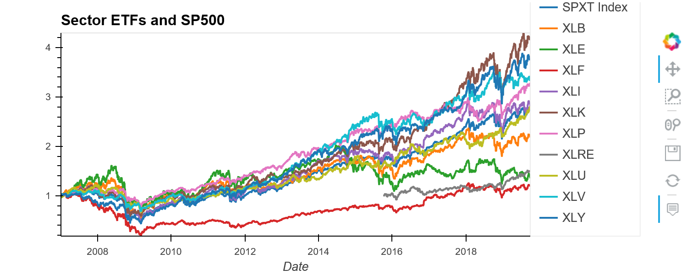
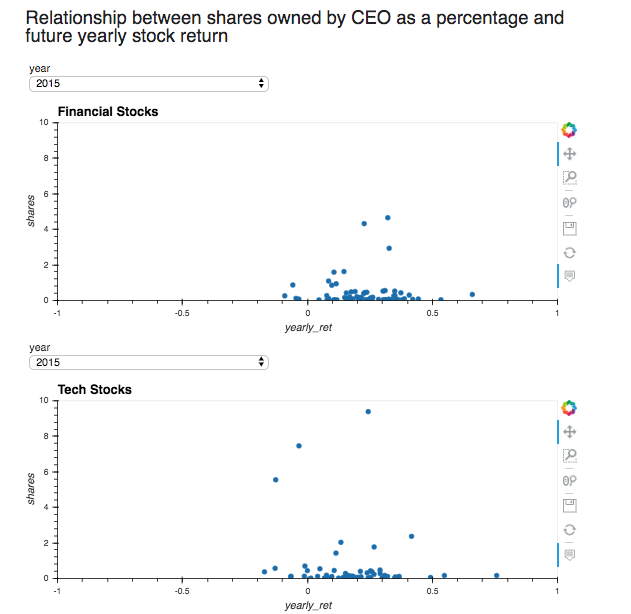
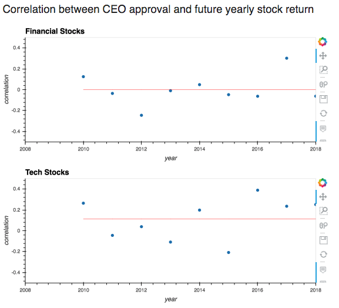

#  CEO Compensation, Financial & Tech Stock Price Analysis

- [1. Intro](https://github.com/KeepItOnTheDownload/FinTech-Group-Project#1-intro)
    + [Requirements](https://github.com/KeepItOnTheDownload/FinTech-Group-Project#requirements)
- [2. Process, Cleaning & Renaming](https://github.com/KeepItOnTheDownload/FinTech-Group-Project#2-process-cleaning--renaming)
- [3. Insights](https://github.com/KeepItOnTheDownload/FinTech-Group-Project#3-insights)
- [4. Plots & Conclusions](https://github.com/KeepItOnTheDownload/FinTech-Group-Project#4-plots--conclusions)
  * [Sector ETFS cummulative returns Plot](https://github.com/KeepItOnTheDownload/FinTech-Group-Project#sector-etfs-cummulative-returns-plot)
  * [Compensation Plot](https://github.com/KeepItOnTheDownload/FinTech-Group-Project#compensation-plot)
  * [Tenure Plot](https://github.com/KeepItOnTheDownload/FinTech-Group-Project#tenure-plot)
  * [Ownership Plot](https://github.com/KeepItOnTheDownload/FinTech-Group-Project#ownership-plot)
  * [Approval Plot](https://github.com/KeepItOnTheDownload/FinTech-Group-Project#approval-plot)
  * [Combined Plot](https://github.com/KeepItOnTheDownload/FinTech-Group-Project#combined-plot)
- [Jupyter Notebooks]()
    * [Dashboard](dashboard2_project.ipynb)
    * [Code](JupyterLabCode.ipynb)

---


# 1. Intro
In this project we will evaluate CEO compensation, tenure, acceptance rate by board and shares owned by executives in order to predict stock prices for stocks belonging to the tech or financial sector 
   
In the vast landscape of the US equity market there were many sectors we could have focused on but for the purpose of this class we focused on finance and technology. We were able to look up the holdings of two of the biggest ETFs that ecapsulate these two sectors. XLF is a finance ETF that has holdings of 68 of the largest finance stocks in the U.S. economy. From this sector we were able to analyze the stock prices of banks like JP Morgan, Bank of America & Wells Fargo among others.

From the XLK ETF we were able to determine the 68 biggest technology companies in the U.S. market. These companies were led by names like Microsoft, Apple, Adobe and Intel. Along with this information we were able to find data on CEO compensation going back to 2007. The benefit of choosing between these two sectors is that since 2007, Technology has been the leader in the recovery of the economy since the Great Financial Crisis. Meanwhile Financials has been a laggard, with multiple big banks coming under scrutiny for recieving bailouts from the U.S. taxpayers and CEO compensation becoming a big talking point. Should these banks that "failed" be rewarding their CEOs with gigantic salaries? Is there a correlation between these large salaries and the companies doing better? We try to answer these questions in the report.

We initally ran into some problems obtaining data from online APIs. Although we were able to access IEX Cloud for financial data, it limited us to the last 5 years. To solve this problem we gained access to a Bloomberg Terminal and were able to pull data going back 12 years to 2007. From this data source we were able to pull:
 - Stock prices of all the stocks in XLF and XLK
- CEO compensation dating back to 2007
- Percentage of shares outsanding held by the CEO
- CEO Tenure in years
- CEO approval by board over a time frame 

---
<details open><summary>Requirements</summary>

##  Requirements: 

- [x]  Use Pandas to clean and format your dataset(s).

- [x] Create a Jupyter Notebook describing the **data exploration and cleanup** process.

- [x] Create a Jupyter Notebook illustrating the **final data analysis**.

- [x] Use PyViz, Panel, Plotly Express, and Hvplot to create six to eight visualizations of your data (ideally, at least two per question you ask of your data), and then aggregate these visualizations into a dashboard.

- [x] Save PNG images of your visualizations to distribute to the class and instructional team and for inclusion in your presentation and your repo's README.md file.

- [x] Use one new Python library that hasn't been covered in class.

- [x] Optionally, use at least one API, if you can find an API with data pertinent to your primary research questions.

- [x] Create a README.md in your repo with a write-up summarizing your major findings. This should include a heading for each question you asked of your data and under each heading a short description of what you found and any relevant plots.</details>
---
# 2. Process, Cleaning & Renaming

## Process
Inorder to gather the necessary data to perfome meaningful analysis and adhear to the requirement we used the CSV files listed below and created them into DataFrames. As we initally ran into some problems obtaining data from online APIs. Although we were able to access IEX Cloud for financial data, it limited us to the last 5 years. To solve this problem we gained access to a Bloomberg Terminal and were able to pull data going back 12 years to 2007. From this data source we were able to pull:
* Stock prices of all the stocks in XLF and XLK
* The market cap of the stock
* CEO compensation dating back to 2007
* Shares owned by the CEO
* Approval of the board over the timeframe
  

After obtaining the data, the first step was cleaning the data. Loading in the csv documents, we initially changed the date to the index and later dropped the column for "Date". By doing this for all the datasets we could use the DateTimeIndex as the unviersal index throughout the data. Please note that the dataframes are not from the same lenghth.

Using a new package called Missingno, we were able to visualize what data we were missing. This new package will read through our dataframe and let us know what data was NaN or unavailable, allowing us to see where our data was most reliable and where it was not.

Using this new package, we were able to clean our data by removing all the rows with NaN values.

On top of checking the holdings of XLF and XLK for their performance over the timeframe, we were able to check the performance of each sector of the US economy.

---
<details><summary>Relevant Libraries</summary>

### Libraries 
```javascript
import pandas as pd
import numpy as np
import datetime as dt
from pathlib import Path
import os
import matplotlib.pyplot as plt
import hvplot.pandas
import plotly.express as px
import matplotlib
import panel as pn
from panel.interact import interact
from panel import widgets
import matplotlib
import missingno as msno
get_ipython().run_line_magic('matplotlib','inline')
```
</details>
<details><summary>CSV Files</summary>

### Files: 
```javascript
approval_fin.csv
approval_tech.csv
comp_fin.csv
comp_tech.csv
mktcap_fin.csv
mktcap_tech.csv
price_fin.csv
price_tech.csv
sector_prices.csv
sharesceo_fin.csv
sharesceo_tech.csv
tenure_fin.csv
tenure_tech.csv
```
</details>
<details><summary>Data Clean-up</summary>

### Clean-up Code:
#### Reading approval rate of CEO for finanacial stocks:
```javascript
temp_csv = Path("Resources/approval_fin.csv"data1_fin=pd.read_csv(temp_csv)
data1_fin.set_index(pd.to_datetime(data1_fin['Date']infer_datetime_format=True),inplace=True)
data1_fin.drop(columns=['Date'], inplace=True)} 
    
```

#### Using Missingno to inspect the data and see how much missing data do we have:

Black represents there is a value, while white means that the data is missing 
```javascript
msno.matrix(data1_fin)
```


#### Removing rows with all NaN values: 
```javascript
data1_fin = data1_fin.dropna(how='all')
```
#### Reading approval rate of CEO for technology stocks:
```javascript
temp_csv = Path("Resources/approval_tech.csv")
data1_tech=pd.read_csv(temp_csv)
data1_tech.set_index(pd.to_datetime(data1_tech['Date'], infer_datetime_format=True),inplace=True)
data1_tech.drop(columns=['Date'], inplace=True)
```
#### Using Missingno to inspect the data and see how much missing data do we have:
```javascript
msno.matrix(data1_tech)
```


#### Removing rows with all NaN values:
```javascript
data1_tech = data1_tech.dropna(how='all')
```    

#### Reading compensation rate of CEO for financial stocks:
```javascript
temp_csv = Path("Resources/comp_fin.csv")
data2_fin=pd.read_csv(temp_csv)
data2_fin.set_index(pd.to_datetime(data2_fin['Date'], infer_datetime_format=True), inplace=True)
data2_fin.drop(columns=['Date'], inplace=True)
```
#### Scaling by millions:
```javascript
data2_fin=data2_fin/1000000
```

#### Reading compensation rate of CEO for technology stocks:
```javascript
temp_csv = Path("Resources/comp_tech.csv")
data2_tech=pd.read_csv(temp_csv)
data2_tech.set_index(pd.to_datetime(data2_tech['Date'], infer_datetime_format=True),inplace=True)
data2_tech.drop(columns=['Date'], inplace=True)
```
#### Scaling by million: 
```javascript
data2_tech=data2_tech/1000000
```


#### Reading tenure of CEO for financials stocks - measure in years: 
```javascript
temp_csv = Path("Resources/tenure_fin.csv")
data3_fin=pd.read_csv(temp_csv)
data3_fin.set_index(pd.to_datetime(data3_fin['Date'], infer_datetime_format=True), inplace=True)
```

#### Reading tenure of CEO for technology stocks - measure in years: 
```javascript
temp_csv = Path("Resources/tenure_tech.csv")
data3_tech=pd.read_csv(temp_csv)data3_tech.set_index(pd.to_datetime(data3_tech['Date'],infer_datetime_format=True), inplace=True)
```
#### Reading shares owned by ceo as % of shares outstanding for financial stocks:
```javascript
temp_csv = Path("Resources/sharesceo_fin.csv")
data4_fin=pd.read_csv(temp_csv)
data4_fin.set_index(pd.to_datetime(data4_fin['Date'], infer_datetime_format=True), inplace=True)
data4_fin.drop(columns=['Date'], inplace=True)
```
#### Using Missingo to inspect the data and see how much missing data do we have:
We are only able to pull 4 years worth of data thus we need to analyze this data by year.
```javascript
msno.matrix(data4_fin)
```
.png)

#### Removing rows with all NaN values: 
```javascript
data4_fin = data4_fin.dropna(how='all')
```
#### Reading shares owned by ceo as % of shares outstanding for technology stocks:
```javascript
temp_csv = Path("Resources/sharesceo_tech.csv")
data4_tech=pd.read_csv(temp_csv)
data4_tech.set_index(pd.to_datetime(data4_tech['Date'], infer_datetime_format=True),inplace=True)
data4_tech.drop(columns=['Date'], inplace=True)
```
#### Using Missingo to inspect the data and see how much missing data do we have:
```javascript
msno.matrix(data4_tech)
```
.png)


#### Removing rows with all NaN values:
```javascript
data4_tech = data4_tech.dropna(how='all')
```

#### Using new package to inspect the data and see how much missing data do we have:
XLRE missing the majority of the data -- this classification for real state is a new convention
```javascript
msno.matrix(ret_sector) 
```
 </details>

--- 
# 3. Insights

Using the two datasets [Financial Data](Resources/comp_fin.csv) & [Tech Data](Resources/comp_tech.csv) we created a boxplot to  evaluate the compensation in both the finance sector and the technology sector. While the technology sector has very little variance between compensation, there is a relatively high variance in compensation for the finance sector.

We attributed this to the data going back as far as 2007 and covering the Great Financial Crisis. During this time, compensation for CEOs of the big banks came under scrutiny. In 2009 the compensation for the CEOs of JP Morgan, Citi, Goldman Sachs and Morgan Stanley were considerably lower. We also found that these same companies had many outliers and the compensation for the CEOs was well above the mean. Our group attributed this to the recovery of the Financials industry and stabilization in the markets and one of the longest bull runs in the US Equity market history.

In technology there were not many outliers to CEO compensation. One that stands out is Oracle's CEOS compensation more than doubled in 2018 to over $400 million dollars. We further looked into this and found that this pay package has a marginal vicotry, with 46% of the ballot voting against the pay package. We later examine the approval metrics of the XLK and can observe that Oracle has one of the lower approval ratings for CEO compensation.
(https://www.nhbr.com/four-top-oracle-execs-total-compensation-tops-400-million/)

Another outlier on the CEO compensation metric is the compensation for AIG CEO Brian Duppereault. In 2017 Duppereault made $43.1 million. This included a $12 million sign on bonus. This is an extreme outlier and comes right after activist investors called for the resignation of former CEO Peter Hancock. Concluding that investors were willing to "pay up" for this top level CEO to see if he could turn things around. This is a case where CEO compensation did not correlate with stock growth. In 2018 AIG's stock fell roughly %34  and Duppereault's compensation fell back down to Earth to $20.9 million. It is yet to be determined if Mr. Duppereault can turn things around for AIG in his tenure.

https://www.wsj.com/articles/aig-ceo-brian-duperreaults-pay-totaled-20-9-million-in-2018-11554238358

We were able to analyze the tenures of the these stocks and determine if this had any effect on the stock. The immediate observation from looking at tenures of XLF is the length of Berkshire Hathway's CEO  Warren Buffet. This legendary investor is known for his buy and hold strategy and it seems his tenure at Berkshire Hathaway has been nothing but prosperus. It should also be noted that when looking at ownership of the the stock by CEO, Warren Buffet towers over other CEO holding way more shares of his own stock than any other CEO. This could be attributed to multiple factors, one of them being the tenure. Given the amount of time as CEO, Warren Buffet has had the most availability to stock options and acquiring stock. Combined with his personal style of "buy and hold", it makes sense that Warren Buffet holds so much Berkshire Hathaway stock. This will also correlate with CEO board approval, which is one of the highest.

After conducting our research we looked back at areas that may have been problematic in our dissection of the data. The first one that we realized is that we took a present day snapshot of the indices. This is problematic because this only shows the companies that managed to survive the Great Financial Crisis and thrive since. It does not highlight the companies that may have provided hefty compensation only to have their company go bankrupt or at least lose a major portion of market cap. 

If we went back to 2007 and captured a snapshot of the companies that made up the indices, our data may have been less correlated. Another bias we may have had with our data is that the metrics used may have been skewed. CEO notoriously have complicated payment structures, some recieve compensation based on different metrics, and recieve it in multiple ways. It would take a more intesive study with more insight into the contracts to truly determine all the ways that CEO's are compensated and if we are measuring it correctly. 

Also we are unsure if market cap or stock price are correct metrics to measure success with also. P/E ratios were considered but based on the data available we chose this metric. Further insight might lead us to use a different metric in the future.

# 4. Plots & Conclusions
## Sector ETFS Cummulative Returns Plot:
On top of checking the holdings of XLF and XLK for their performance over the timeframe, we were able to check the performance of each sector of the US economy.



## Compensation Plot:
Given that the distribution is tighter for tech we should expect finantial metrics to have more predictability. Upon evaluating the plots the team finds that the correlation analysis between compensation and yearly return is forward looking. 

Horizontal line is the mean value over the period analyzed. We can see that for financial stocks the correlation is almost 0 over time,it fluctuates some years positive, others negative.

We can see that for tech stocks the correlation is negative over time, the more compensation the CEO gets the worst the stock performs in later years. Correlation is subtle .. not that high though. overall CEO comp is negatively correlated with future performance.


## Tenure Plot:
Upon evaluating the plots the team finds that correlation analysis between tenure and yearly return is forward looking. 

We can see that for financial stocks the correlation is slightly positive over time, very small though, we need more data to validate.

We can see that for tech stocks the correlation is slightly positive over time. which means that if the CEO remains in the company for a long period of time that is a good indication of future stock performance, while if there is a lot of turnover that is an indication of stock underperformance in the future Tech stocks exhibit clearer pattern than financial stocks.


## Ownership Plot:
We created scatter plots for shares owned by ceo as % of shares outstanding for financial stocks, technology stocks and yearly return.

The hypothesis we are trying to solve is that we think that when there is more at stake for the CEO financialy the more he/she be concern on managing well the company. it is midly confirm with the data. There is very little dispersion on the metric as most CEOs own similar percentages of shared for the majority of the stocks.




## Approval Plot:
Upon evaluating the plots the team finds that correlation analysis between approval and yearly return is forward looking. The horizontal line is the mean value over the period analyzed.We can see that for financial stocks it does not appear that there is a relationship between approval and future performance. A Correlation 0 over time.



## Combined Plot:
Extract selecting year 2015 for tech stocks and visually see interactions Compensation, approval, tenure. We are calculating rank on each metric and we want to see the extreme values relationship given that the correlation are low on the 3 metrics.


